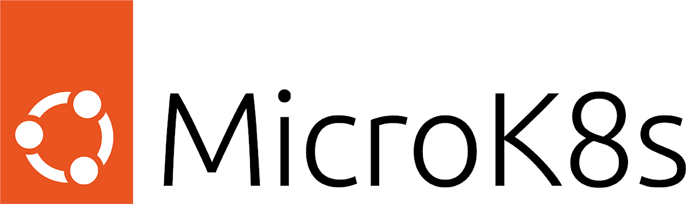

[](https://github.com/canonical/microk8s/actions/workflows/build-snap.yml)
[](https://snapcraft.io/microk8s)


## The smallest, fastest Kubernetes

Single-package fully conformant lightweight Kubernetes that works on [42
flavours of Linux](https://snapcraft.io/microk8s). Perfect for:

- Developer workstations
- IoT
- Edge
- CI/CD

 > Canonical might have assembled the easiest way to provision a single node Kubernetes cluster - [Kelsey Hightower](https://twitter.com/kelseyhightower/status/1120834594138406912)

## Why MicroK8s?

- **Small**. Developers want the smallest K8s for laptop and workstation
  development.  MicroK8s provides a standalone K8s compatible with Azure
  AKS, Amazon EKS, Google GKE when you run it on Ubuntu.

- **Simple**. Minimize administration and operations with a single-package
  install that has no moving parts for simplicity and certainty. All
  dependencies and batteries included.

- **Secure**. Updates are available for all security issues and can be
  applied immediately or scheduled to suit your maintenance cycle.

- **Current**. MicroK8s tracks upstream and releases beta, RC and final bits
  the same day as upstream K8s. You can track latest K8s or stick to any
  release version from 1.10 onwards.

- **Comprehensive**. MicroK8s includes a curated collection of manifests for
  common K8s capabilities and services:

  - Service Mesh: Istio, Linkerd
  - Serverless: Knative
  - Monitoring: Fluentd, Prometheus, Grafana, Metrics
  - Ingress, DNS, Dashboard, Clustering
  - Automatic updates to the latest Kubernetes version
  - GPGPU bindings for AI/ML

Drop us a line at [MicroK8s in the Wild](docs/community.md) if you are
doing something fun with MicroK8s!

## Quickstart

Install MicroK8s with:

```
snap install microk8s --classic
```

MicroK8s includes a `microk8s kubectl` command:

```
sudo microk8s kubectl get nodes
sudo microk8s kubectl get services
```

To use MicroK8s with your existing kubectl:

```
sudo microk8s kubectl config view --raw > $HOME/.kube/config
```

#### User access without sudo
The *microk8s* user group is created during the snap installation. Users in that group
are granted access to `microk8s` commands. To add a user to that group:
```
sudo usermod -a -G microk8s <username>
```


#### Kubernetes add-ons

MicroK8s installs a barebones upstream Kubernetes. Additional services like dns and the Kubernetes dashboard can be enabled using the `microk8s enable` command.

```
sudo microk8s enable dns
sudo microk8s enable dashboard
```

Use `microk8s status` to see a list of enabled and available addons. You can find the addon manifests and/or scripts under `${SNAP}/actions/`, with `${SNAP}` pointing by default to `/snap/microk8s/current`.

## Documentation

The [official docs](https://microk8s.io/docs/) are maintained in the
Kubernetes upstream Discourse.

Take a look at the [build instructions](docs/build.md) if you want to
contribute to MicroK8s.

<a href="https://snapcraft.io/microk8s" title="Get it from the Snap Store">
            
          </a>

<a href="https://github.com/canonical/microk8s/graphs/contributors">
  
</a>
